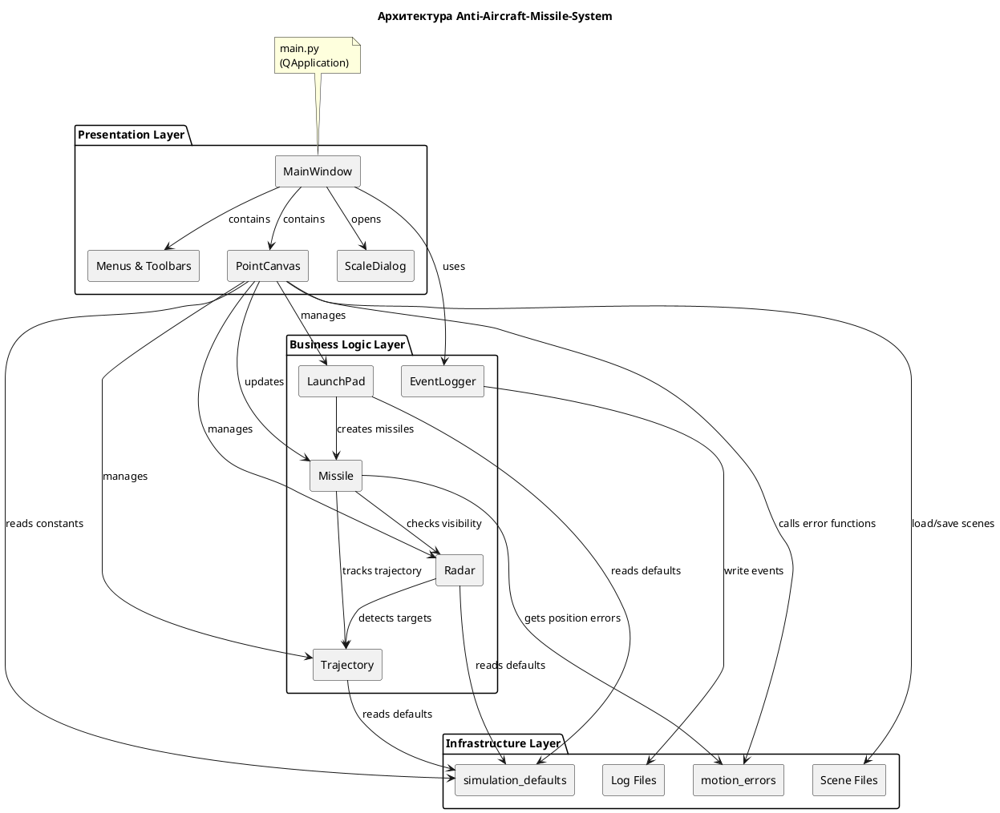
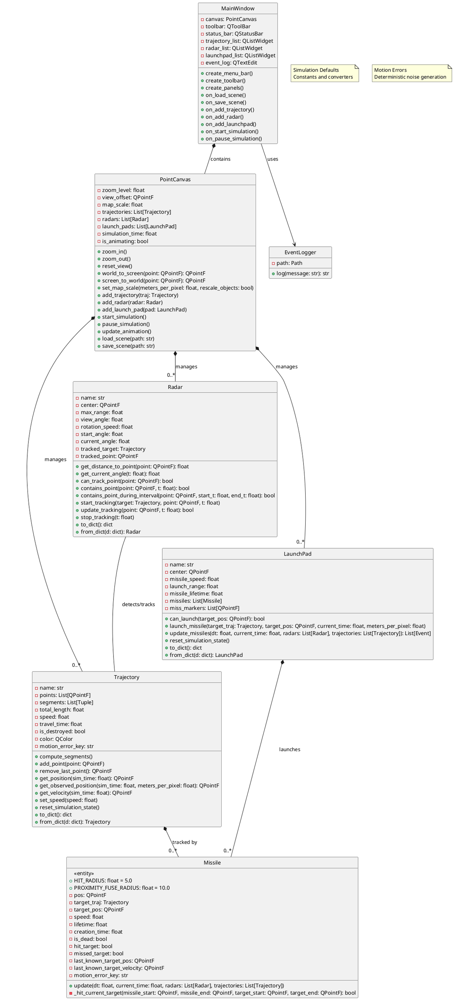
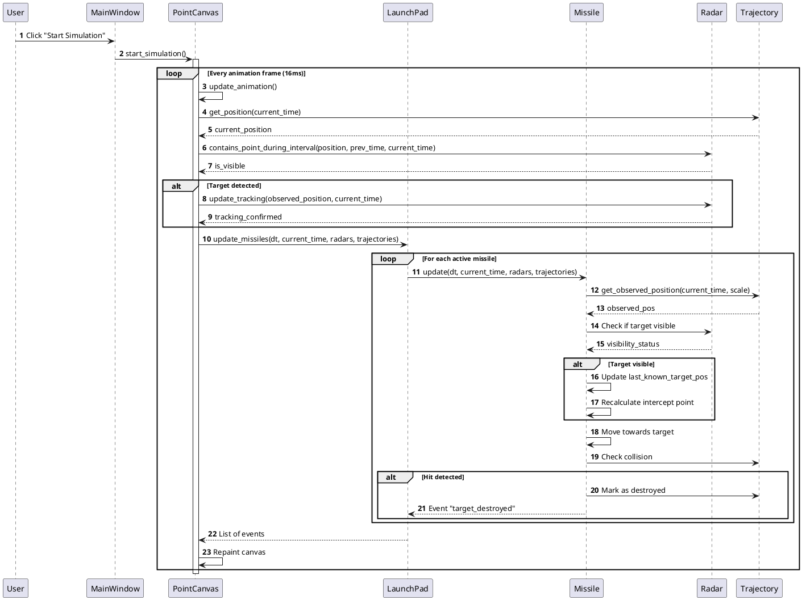
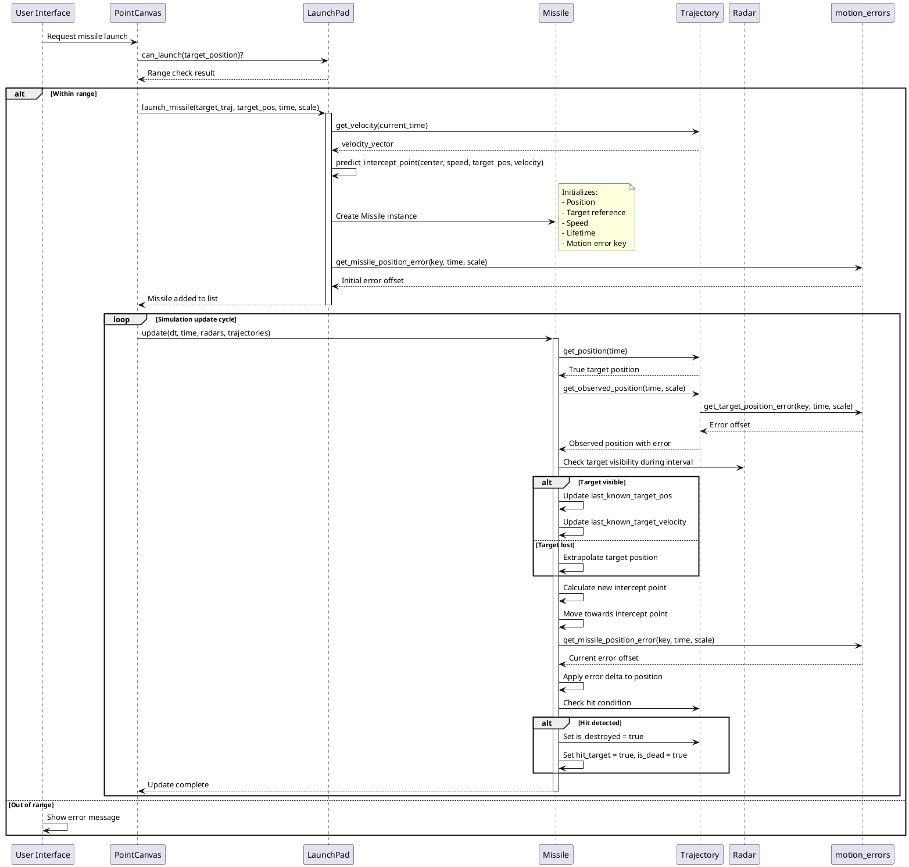

# Документация проекта Anti-Aircraft-Missile-System

## 1. Описание проекта

### 1.1. Назначение системы

Anti-Aircraft-Missile-System — это программный симулятор системы противовоздушной обороны (ПВО), разработанный на языке программирования Python с использованием фреймворка PyQt6 для создания графического пользовательского интерфейса. Проект предназначен для моделирования процессов обнаружения, сопровождения и поражения воздушных целей зенитными ракетными комплексами.

Система предоставляет возможности:
- Визуализации тактической обстановки на карте местности
- Моделирования движения воздушных целей по заданным траекториям
- Размещения и настройки радиолокационных станций (РЛС) обнаружения и сопровождения
- Размещения и управления пусковыми установками зенитных ракет
- Моделирования процесса запуска ракет и их наведения на цели
- Анализа эффективности перехвата целей
- Сохранения и загрузки сценариев симуляции

### 1.2. Область применения

Проект может использоваться в следующих целях:
- Учебно-тренировочные задачи для операторов систем ПВО
- Исследование алгоритмов наведения и перехвата целей
- Визуализация принципов работы радиолокационных средств
- Демонстрация тактико-технических характеристик зенитных ракетных комплексов
- Научно-исследовательские работы в области управления системами ПВО

### 1.3. Ключевые возможности

1. **Моделирование траекторий целей**: Система поддерживает создание многосегментных траекторий движения воздушных целей с возможностью задания скорости движения.

2. **Радиолокационное обнаружение**: Реализована модель работы РЛС с учетом:
   - Дальности обнаружения целей
   - Угла обзора антенной системы
   - Скорости вращения антенны
   - Режима сопровождения обнаруженных целей

3. **Пусковые установки**: Моделирование работы зенитных ракетных комплексов включает:
   - Зону пуска ракет по дальности
   - Скорость полета ракеты
   - Время жизни ракеты (двигательной установки)
   - Автоматическое определение точки встречи с целью

4. **Наведение ракет**: Система использует метод пропорционального сближения для расчета точки перехвата цели с учетом:
   - Текущего положения цели
   - Вектора скорости цели
   - Положения пусковой установки
   - Скорости ракеты

5. **Моделирование погрешностей**: В систему заложены модели погрешностей определения координат целей и ракет, основанные на детерминированных псевдослучайных функциях.

6. **Визуализация**: Графический интерфейс обеспечивает:
   - Отображение карты местности с возможностью масштабирования
   - Отображение сетки координат с подписями расстояний
   - Визуализацию зон обнаружения РЛС
   - Отображение траекторий движения целей и ракет
   - Индикацию масштаба на экране

---

## 2. Структура проекта

### 2.1. Обзор файловой структуры

```
/workspace/
├── README.md                    # Краткое описание проекта
├── requirements.txt             # Список зависимостей Python
├── images/                      # Директория с графическими ресурсами
│   ├── demo.jpeg                # Демонстрационное изображение
│   ├── map.png                  # Основной файл карты местности
│   ├── map1.png                 # Альтернативные файлы карт
│   ├── map2.png
│   ├── map3.jpg
│   ├── map4.jpg
│   ├── map5.jpg
│   ├── map6.jpg
│   ├── map7.jpg
│   ├── map8.jpg
│   ├── map9.jpg
│   └── icons/                   # Иконки пользовательского интерфейса
├── scenes/                      # Директория с файлами сценариев
│   ├── demo.json                # Демонстрационный сценарий
│   ├── scene.json               # Базовый сценарий
│   ├── scene2.json              # Дополнительные сценарии
│   ├── scene3.json
│   └── scene4.json
└── src/                         # Исходный код проекта
    ├── main.py                  # Точка входа в приложение
    ├── gui.py                   # Графический интерфейс пользователя
    ├── trajectory.py            # Модель траектории цели
    ├── radar.py                 # Модель радиолокационной станции
    ├── launchpad.py             # Модель пусковой установки
    ├── missile.py               # Модель зенитной ракеты
    ├── motion_errors.py         # Модели погрешностей измерения
    ├── event_logger.py          # Система логирования событий
    ├── simulation_defaults.py   # Параметры симуляции по умолчанию
    └── command_center.py        # Модель командного центра
```

### 2.2. Описание модулей исходного кода

#### 2.2.1. main.py (9 строк)

**Назначение**: Точка входа в приложение.

**Функциональность**:
- Инициализация приложения PyQt6
- Создание экземпляра главного окна MainWindow
- Запуск цикла обработки событий GUI

**Зависимости**:
- PyQt6.QtWidgets.QApplication
- gui.MainWindow

#### 2.2.2. gui.py (1936 строк)

**Назначение**: Реализация графического пользовательского интерфейса и основной логики симуляции.

**Основные классы**:

**ScaleDialog**:
- Диалоговое окно для изменения масштаба карты
- Позволяет пользователю задать соотношение метров на пиксель
- Содержит информационную подсказку о влиянии масштаба

**PointCanvas**:
- Основной виджет для отображения тактической обстановки
- Реализует функции:
  - Отрисовка карты местности (фоновое изображение)
  - Отображение сетки координат
  - Масштабирование и панорамирование вида
  - Отрисовка траекторий целей
  - Отображение РЛС и их зон обнаружения
  - Визуализация пусковых установок
  - Анимация движения объектов
  - Отображение шкалы масштаба

**MainWindow**:
- Главное окно приложения
- Содержит:
  - Панель инструментов с кнопками управления
  - Меню файлов, настроек, помощи
  - Панель управления симуляцией
  - Список траекторий, РЛС, пусковых установок
  - Журнал событий симуляции
  - Элементы управления воспроизведением (старт, пауза, перемотка)

**Ключевые функции PointCanvas**:
- `zoom_in()`, `zoom_out()`, `reset_view()` — управление масштабом
- `world_to_screen()`, `screen_to_world()` — преобразование координат
- `set_map_scale()` — установка масштаба карты
- `draw_grid()` — отрисовка координатной сетки
- `draw_scale_bar()` — отрисовка шкалы масштаба
- `set_background_image()` — загрузка фонового изображения карты
- `update_animation()` — обновление состояния симуляции
- `add_trajectory()`, `add_radar()`, `add_launch_pad()` — добавление объектов
- `load_scene()`, `save_scene()` — работа с файлами сценариев

#### 2.2.3. trajectory.py (177 строк)

**Назначение**: Моделирование траектории движения воздушной цели.

**Класс Trajectory**:

**Атрибуты**:
- `name` — наименование траектории
- `points` — список точек траектории (QPointF)
- `segments` — вычисленные сегменты между точками
- `total_length` — общая длина траектории
- `speed` — скорость движения по траектории (пикселей/секунду)
- `travel_time` — время прохождения всей траектории
- `is_destroyed` — флаг уничтожения цели
- `color` — цвет отображения траектории
- `motion_error_key` — ключ для генерации погрешностей

**Методы**:
- `compute_segments()` — вычисление сегментов и общей длины
- `add_point(point)` — добавление точки к траектории
- `remove_last_point()` — удаление последней точки
- `get_position(sim_time)` — получение позиции цели в заданное время
- `get_observed_position(sim_time, meters_per_pixel)` — позиция с учетом погрешности
- `get_position_by_t(t)` — позиция по нормализованному времени (0-1)
- `get_velocity(sim_time)` — вектор скорости в заданный момент
- `set_speed(speed)` — установка скорости
- `reset_simulation_state()` — сброс состояния симуляции
- `to_dict()` — сериализация в словарь
- `from_dict(d)` — десериализация из словаря

#### 2.2.4. radar.py (134 строки)

**Назначение**: Моделирование радиолокационной станции.

**Класс Radar**:

**Атрибуты**:
- `name` — наименование РЛС
- `center` — координаты размещения (QPointF)
- `max_range` — максимальная дальность обнаружения
- `view_angle` — угол обзора антенны (градусы)
- `rotation_speed` — скорость вращения антенны (градусы/секунду)
- `start_angle` — начальный угол ориентации
- `current_angle` — текущий угол ориентации
- `tracked_target` — сопровождаемая цель
- `tracked_point` — сопровождаемая точка

**Методы**:
- `get_distance_to_point(point)` — расстояние до точки
- `get_current_angle(t)` — текущий угол в момент времени t
- `can_track_point(point)` — проверка возможности сопровождения
- `contains_point(point, t)` — проверка попадания точки в зону обнаружения
- `contains_point_during_interval(point, start_t, end_t)` — проверка обнаружения за интервал
- `start_tracking(target, point, t)` — начало сопровождения цели
- `update_tracking(point, t)` — обновление сопровождения
- `stop_tracking(t)` — прекращение сопровождения
- `to_dict()` — сериализация
- `from_dict(d)` — десериализация

#### 2.2.5. launchpad.py (82 строки)

**Назначение**: Моделирование пусковой установки зенитных ракет.

**Класс LaunchPad**:

**Атрибуты**:
- `name` — наименование пусковой установки
- `center` — координаты размещения (QPointF)
- `missile_speed` — скорость ракеты (пикселей/секунду)
- `launch_range` — максимальная дальность пуска
- `missile_lifetime` — время жизни ракеты (секунды)
- `missiles` — список активных ракет
- `miss_markers` — маркеры промахов

**Методы**:
- `get_distance(p1, p2)` — расстояние между точками
- `can_launch(target_pos)` — проверка возможности пуска по цели
- `launch_missile(target_traj, target_pos, current_time, meters_per_pixel)` — запуск ракеты
- `update_missiles(dt, current_time, radars, trajectories)` — обновление состояния ракет
- `reset_simulation_state()` — сброс состояния
- `to_dict()` — сериализация
- `from_dict(d)` — десериализация

#### 2.2.6. missile.py (221 строка)

**Назначение**: Моделирование зенитной управляемой ракеты.

**Константы**:
- `HIT_RADIUS` — радиус прямого попадания (5.0 пикселей)
- `PROXIMITY_FUSE_RADIUS` — радиус срабатывания неконтактного взрывателя (10.0 пикселей)

**Класс Missile**:

**Атрибуты**:
- `pos` — текущая позиция ракеты
- `target_traj` — целевая траектория
- `target_pos` — текущая целевая точка перехвата
- `speed` — скорость ракеты
- `lifetime` — время жизни
- `creation_time` — время запуска
- `is_dead` — флаг завершения полета
- `hit_target` — флаг поражения цели
- `missed_target` — флаг промаха
- `last_known_target_pos` — последняя известная позиция цели
- `last_known_target_velocity` — последняя известная скорость цели
- `motion_error_key` — ключ для генерации погрешностей

**Методы**:
- `update(dt, current_time, radars, trajectories)` — обновление состояния ракеты
- `_hit_current_target(missile_start, missile_end, target_start, target_end)` — проверка попадания

**Функции**:
- `_distance(p1, p2)` — вычисление расстояния
- `_solve_intercept_time(...)` — решение уравнения встречи
- `predict_intercept_point(...)` — прогнозирование точки перехвата

#### 2.2.7. motion_errors.py (62 строки)

**Назначение**: Генерация детерминированных погрешностей измерения координат.

**Константы**:
- `TARGET_POSITION_ERROR_M` — амплитуда погрешности цели (1000 м)
- `MISSILE_POSITION_ERROR_M` — амплитуда погрешности ракеты (500 м)
- `TARGET_ERROR_PERIOD_S` — период изменения погрешности цели (1.5 с)
- `MISSILE_ERROR_PERIOD_S` — период изменения погрешности ракеты (0.35 с)

**Функции**:
- `_stable_noise_sample(seed_key, axis, index)` — генерация стабильного псевдослучайного значения
- `_smoothstep(value)` — функция плавного перехода
- `_get_position_error(...)` — базовая функция получения погрешности
- `get_target_position_error(seed_key, sim_time, meters_per_pixel)` — погрешность цели
- `get_missile_position_error(seed_key, sim_time, meters_per_pixel)` — погрешность ракеты

#### 2.2.8. event_logger.py (16 строк)

**Назначение**: Логирование событий симуляции.

**Класс EventLogger**:

**Атрибуты**:
- `path` — путь к файлу журнала

**Методы**:
- `log(message)` — запись события с временной меткой

#### 2.2.9. simulation_defaults.py (44 строки)

**Назначение**: Определение параметров симуляции по умолчанию.

**Константы**:
- `SPEED_OF_SOUND_MPS` — скорость звука (340 м/с)
- `METERS_PER_PIXEL` — масштаб по умолчанию (500 м/пиксель)
- `MAX_SIMULATION_DURATION_S` — максимальная длительность симуляции
- `ANIMATION_INTERVAL_MS` — интервал обновления анимации (16 мс)
- `DEFAULT_PLAYBACK_SPEED` — скорость воспроизведения по умолчанию

**Параметры целей**:
- `DEFAULT_TARGET_NAME` — наименование цели по умолчанию ("МиГ-31БМ")
- `DEFAULT_TARGET_SPEED_KMH` — скорость цели (3000 км/ч)
- `DEFAULT_TARGET_SPEED_MPS` — скорость цели в м/с
- `DEFAULT_TRAJECTORY_SPEED` — скорость траектории в пикселях/секунду

**Параметры РЛС**:
- `DEFAULT_RADAR_NAME` — наименование РЛС ("Небо-СВ")
- `DEFAULT_RADAR_RANGE_M` — дальность обнаружения (350 км)
- `DEFAULT_RADAR_ROTATION_PERIOD_S` — период вращения антенны (10 с)
- `DEFAULT_RADAR_ROTATION_SPEED` — скорость вращения (градусы/с)
- `DEFAULT_RADAR_VIEW_ANGLE` — ширина луча (6 градусов)

**Параметры пусковых установок**:
- `DEFAULT_LAUNCHPAD_NAME` — наименование комплекса ("С-300ПМУ")
- `DEFAULT_MISSILE_RANGE_M` — дальность пуска (150 км)
- `DEFAULT_MISSILE_SPEED_MPS` — скорость ракеты (2000 м/с)
- `DEFAULT_MISSILE_SPEED` — скорость в пикселях/секунду
- `DEFAULT_LAUNCH_RANGE` — дальность пуска в пикселях
- `DEFAULT_MISSILE_LIFETIME` — время жизни ракеты

**Функции**:
- `meters_to_pixels(distance_m)` — конвертация метров в пиксели
- `mps_to_pixels_per_second(speed_mps)` — конвертация скорости

#### 2.2.10. command_center.py (13 строк)

**Назначение**: Модель командного центра системы ПВО.

**Класс CommandCenter**:

**Атрибуты**:
- `name` — наименование командного центра
- `id` — уникальный идентификатор (UUID)
- `x`, `y`, `z` — координаты размещения
- `target_distribution_algorithm` — алгоритм распределения целей
- `connected_radiolocators` — список подключенных РЛС
- `connected_launchers` — список подключенных пусковых установок

**Примечание**: Данный модуль содержит ссылки на несуществующие модули `.radiolocator` и `.rocket_launcher`, что указывает на незавершенность реализации или наличие устаревшего кода.

### 2.3. Формат файлов сценариев

Файлы сценариев хранятся в формате JSON со следующей структурой:

```json
{
    "version": 2,
    "trajectories": [
        {
            "name": "Траектория 1",
            "color": {"r": 40, "g": 193, "b": 3},
            "speed": 200.0,
            "points": [[x1, y1], [x2, y2], ...]
        }
    ],
    "radars": [
        {
            "name": "РЛС 1",
            "center": [x, y],
            "max_range": 100.0,
            "view_angle": 90.0,
            "rotation_speed": 45.0,
            "start_angle": 0.0
        }
    ],
    "launchpads": [
        {
            "name": "ПУ 1",
            "center": [x, y],
            "missile_speed": 200.0,
            "launch_range": 200.0,
            "missile_lifetime": 5.0
        }
    ]
}
```

---

## 3. Архитектура системы

### 3.1. Общая архитектура

Система построена по модульному принципу с четким разделением ответственности между компонентами. Архитектура следует паттерну Model-View-Controller (MVC) с элементами событийно-ориентированного программирования.



### 3.2. Компонентная диаграмма

```plantuml
@startuml
skinparam componentStyle uml2
skinparam packageStyle rectangle

package "src" {
    component "main.py" as MAIN {
        interface "EntryPoint" as EP
    }
    
    component "gui.py" as GUI {
        interface "IUserInterface" as IUI
        class "MainWindow"
        class "PointCanvas"
        class "ScaleDialog"
    }
    
    component "trajectory.py" as TRAJ {
        class "Trajectory"
    }
    
    component "radar.py" as RADAR {
        class "Radar"
    }
    
    component "launchpad.py" as LAUNCH {
        class "LaunchPad"
    }
    
    component "missile.py" as MISSILE {
        class "Missile"
        function "predict_intercept_point()"
    }
    
    component "motion_errors.py" as ERRORS {
        function "get_target_position_error()"
        function "get_missile_position_error()"
    }
    
    component "event_logger.py" as LOGGER {
        class "EventLogger"
    }
    
    component "simulation_defaults.py" as CONFIG {
        interface "IConfiguration"
    }
    
    component "command_center.py" as COMMAND {
        class "CommandCenter"
    }
}

' Dependencies
MAIN --> GUI
GUI --> TRAJ
GUI --> RADAR
GUI --> LAUNCH
GUI --> MISSILE
GUI --> ERRORS
GUI --> LOGGER
GUI --> CONFIG

LAUNCH --> MISSILE
MISSILE --> TRAJ
MISSILE --> RADAR
MISSILE --> ERRORS

RADAR --> TRAJ
TRAJ --> ERRORS

CONFIG ..> TRAJ
CONFIG ..> RADAR
CONFIG ..> LAUNCH

@enduml
```

### 3.3. Диаграмма классов



### 3.4. Диаграмма последовательности запуска симуляции



### 3.5. Поток данных при запуске ракеты



---

## 4. Инструкция по использованию

### 4.1. Установка и настройка окружения

#### 4.1.1. Системные требования

**Операционная система**:
- Windows 10/11
- Linux (Ubuntu 20.04+, Debian 11+, Fedora 35+)
- macOS 11+

**Аппаратные требования**:
- Процессор: 2 ядра, 2.0 ГГц или выше
- Оперативная память: 2 ГБ минимум, 4 ГБ рекомендуется
- Свободное место на диске: 100 МБ
- Видеокарта: поддержка OpenGL 2.0 или выше

**Программные требования**:
- Python 3.8 или выше
- PyQt6

#### 4.1.2. Установка Python

Убедитесь, что на системе установлен Python версии 3.8 или выше. Проверить версию можно командой:

```bash
python --version
```

или

```bash
python3 --version
```

Если Python не установлен, загрузите его с официального сайта https://www.python.org/downloads/

#### 4.1.3. Установка зависимостей

1. Откройте терминал или командную строку
2. Перейдите в директорию проекта:

```bash
cd /workspace
```

3. Установите необходимые зависимости:

```bash
pip install -r requirements.txt
```

Данная команда установит пакет PyQt6 и все его зависимости.

#### 4.1.4. Проверка установки

Для проверки корректности установки выполните:

```bash
python -c "import PyQt6; print(PyQt6.__version__)"
```

Команда должна вывести номер установленной версии PyQt6 без ошибок.

### 4.2. Запуск приложения

#### 4.2.1. Базовый запуск

Для запуска приложения выполните команду из корневой директории проекта:

```bash
cd /workspace/src
python main.py
```

или

```bash
python /workspace/src/main.py
```

#### 4.2.2. Запуск с альтернативным интерпретатором

При наличии нескольких версий Python используйте:

```bash
python3 main.py
```

или укажите полный путь к интерпретатору:

```bash
/usr/bin/python3 main.py
```

### 4.3. Описание пользовательского интерфейса

#### 4.3.1. Главное окно

Главное окно приложения состоит из следующих элементов:

**Верхняя панель меню**:
- Файл — операции с файлами сценариев
- Правка — редактирование объектов
- Вид — настройки отображения
- Симуляция — управление симуляцией
- Справка — информация о программе

**Панель инструментов**:
- Кнопки быстрого доступа к основным функциям
- Инструменты добавления объектов
- Управление воспроизведением

**Центральная область**:
- PointCanvas — основная область визуализации
- Отображает карту, объекты, траектории

**Боковые панели**:
- Список траекторий
- Список РЛС
- Список пусковых установок

**Нижняя панель**:
- Журнал событий
- Элементы управления временем
- Индикаторы состояния

#### 4.3.2. Работа с картой

**Масштабирование**:
- Колесо мыши — увеличение/уменьшение масштаба
- Кнопки "+" и "-" на панели инструментов
- Меню Вид -> Масштаб

**Перемещение**:
- Зажать среднюю кнопку мыши и перемещать курсор
- Или использовать полосы прокрутки

**Сброс вида**:
- Кнопка "Сбросить вид" на панели инструментов
- Меню Вид -> Сбросить масштаб и позицию

**Изменение масштаба карты**:
1. Меню Вид -> Масштаб карты
2. Введите значение в поле "Масштаб" (метры на пиксель)
3. Нажмите OK

Примеры масштабов:
- 100 м/пикс — детальное рассмотрение
- 500 м/пикс — стандартный масштаб
- 1000 м/пикс — общий обзор

#### 4.3.3. Добавление траектории цели

1. Выберите инструмент "Добавить траекторию" на панели инструментов или меню Правка -> Добавить траекторию
2. В списке траекторий появится новая запись
3. Для редактирования траектории:
   - Выделите траекторию в списке
   - Кликните правой кнопкой мыши на карте для добавления точек
   - Точки соединяются линиями, образуя путь движения
4. Настройка параметров:
   - Имя траектории
   - Цвет отображения
   - Скорость движения (в пикселях/секунду или м/с)

**Удаление точки траектории**:
- Выделите траекторию
- Нажмите клавишу Delete для удаления последней точки
- Или используйте контекстное меню

#### 4.3.4. Добавление радиолокационной станции

1. Выберите инструмент "Добавить РЛС" или меню Правка -> Добавить РЛС
2. Кликните на карте для размещения РЛС
3. Настройте параметры в диалоге свойств:
   - Имя РЛС
   - Максимальная дальность обнаружения (метры)
   - Угол обзора (градусы, 0-360)
   - Скорость вращения антенны (градусы/секунду)
   - Начальный угол ориентации

**Индикация РЛС**:
- Сектор показывает текущую зону обзора
- Окружность показывает максимальную дальность
- При обнаружении цели сектор фиксируется на цели

#### 4.3.5. Добавление пусковой установки

1. Выберите инструмент "Добавить ПУ" или меню Правка -> Добавить ПУ
2. Кликните на карте для размещения пусковой установки
3. Настройте параметры:
   - Имя установки
   - Скорость ракеты (м/с)
   - Дальность пуска (метры)
   - Время жизни ракеты (секунды)

**Запуск ракеты**:
1. Выделите пусковую установку
2. Выберите цель (траекторию)
3. Нажмите кнопку "Запустить ракету" или используйте контекстное меню
4. При успешном запуске ракета отобразится на карте

#### 4.3.6. Управление симуляцией

**Запуск симуляции**:
- Кнопка "Старт" на панели инструментов
- Меню Симуляция -> Старт
- Горячая клавиша: F5

**Пауза**:
- Кнопка "Пауза"
- Меню Симуляция -> Пауза
- Горячая клавиша: F6

**Остановка**:
- Меню Симуляция -> Стоп
- Сбрасывает время симуляции в ноль

**Перемотка**:
- Ползунок прогресса внизу окна
- Перемещайте для изменения текущего времени
- В режиме паузы можно установить произвольное время

**Скорость воспроизведения**:
- Ползунок скорости симуляции
- Диапазон: 0.1x до 10.0x
- Значение 1.0 соответствует реальному времени

#### 4.3.7. Работа со сценариями

**Сохранение сценария**:
1. Меню Файл -> Сохранить сценарий
2. Выберите директорию и имя файла
3. Нажмите "Сохранить"

**Загрузка сценария**:
1. Меню Файл -> Открыть сценарий
2. Выберите файл сценария (.json)
3. Нажмите "Открыть"

**Экспорт в изображения**:
- Меню Файл -> Экспорт -> Скриншот
- Сохраняет текущее состояние карты как изображение

### 4.4. Типовые сценарии использования

#### 4.4.1. Базовый сценарий перехвата цели

1. Запустите приложение
2. Добавьте траекторию цели:
   - Создайте 3-5 точек пути
   - Установите скорость 200-400 пикселей/секунду
3. Добавьте РЛС:
   - Разместите вблизи траектории
   - Установите дальность 300-500 пикселей
   - Угол обзора 30-60 градусов
   - Скорость вращения 30-60 градусов/секунду
4. Добавьте пусковую установку:
   - Разместите рядом с РЛС
   - Дальность пуска 200-400 пикселей
   - Скорость ракеты 300-500 пикселей/секунду
5. Запустите симуляцию
6. Дождитесь обнаружения цели РЛС
7. Запустите ракету по цели
8. Наблюдайте за процессом перехвата

#### 4.4.2. Сценарий с несколькими целями

1. Создайте 2-3 траектории с различными путями
2. Разместите несколько РЛС для покрытия зоны
3. Добавьте пусковые установки
4. Настройте приоритеты целей
5. Запустите симуляцию
6. Последовательно запускайте ракеты по целям

#### 4.4.3. Анализ зоны покрытия РЛС

1. Создайте тестовую траекторию
2. Разместите РЛС
3. Запустите симуляцию
4. Наблюдайте за моментами обнаружения/потери цели
5. Корректируйте положение РЛС для оптимизации покрытия

### 4.5. Интерпретация результатов

#### 4.5.1. Индикация состояний

**Траектория цели**:
- Зеленый цвет — активная цель
- Красный цвет — уничтоженная цель
- Пунктирная линия — наблюдаемая траектория (с погрешностью)

**РЛС**:
- Синий сектор — зона сканирования
- Желтый сектор — режим сопровождения
- Пунктирная окружность — максимальная дальность

**Ракета**:
- Треугольник — направление полета
- Красный след — траектория полета
- Взрыв — попадание в цель

#### 4.5.2. Журнал событий

Журнал событий отображает:
- Моменты обнаружения целей
- Запуски ракет
- Результаты перехвата (попадание/промах)
- Ошибки симуляции

Формат записи:
```
[YYYY-MM-DD HH:MM:SS] Сообщение о событии
```

#### 4.5.3. Статистика симуляции

По завершении симуляции доступны данные:
- Общее время симуляции
- Количество запущенных ракет
- Количество пораженных целей
- Процент успешных перехватов

---

## 5. Технические требования

### 5.1. Требования к аппаратному обеспечению

#### 5.1.1. Минимальные требования

| Компонент | Требование |
|-----------|------------|
| Процессор | 2 ядра, 2.0 ГГц |
| Оперативная память | 2 ГБ |
| Видеопамять | 256 МБ |
| Место на диске | 100 МБ |
| Разрешение экрана | 1280x720 |

#### 5.1.2. Рекомендуемые требования

| Компонент | Требование |
|-----------|------------|
| Процессор | 4 ядра, 3.0 ГГц |
| Оперативная память | 4 ГБ |
| Видеопамять | 512 МБ |
| Место на диске | 500 МБ |
| Разрешение экрана | 1920x1080 |

### 5.2. Требования к программному обеспечению

#### 5.2.1. Обязательные зависимости

| Пакет | Минимальная версия | Назначение |
|-------|-------------------|------------|
| Python | 3.8 | Интерпретатор языка |
| PyQt6 | 6.0.0 | Графический интерфейс |

#### 5.2.2. Опциональные зависимости

| Пакет | Назначение |
|-------|------------|
| numpy | Численные вычисления (при расширении функциональности) |
| matplotlib | Построение графиков (для аналитических отчетов) |

### 5.3. Требования к операционной системе

#### 5.3.1. Windows

- Windows 10 (версия 1903 или новее)
- Windows 11
- Требуется установка Visual C++ Redistributable

#### 5.3.2. Linux

- Ubuntu 20.04 LTS или новее
- Debian 11 или новее
- Fedora 35 или новее
- Требуется установленный X11 или Wayland

#### 5.3.3. macOS

- macOS 11 (Big Sur) или новее
- Требуется Xcode Command Line Tools

### 5.4. Сетевые требования

Проект не требует сетевого подключения для базовой функциональности. Сетевое подключение может потребоваться для:
- Загрузки обновлений
- Обмена сценариями между пользователями
- Удаленного логирования событий

### 5.5. Требования к файловой системе

#### 5.5.1. Права доступа

Приложение требует прав на:
- Чтение файлов сценариев в директории scenes/
- Запись файлов сценариев в выбранную пользователем директорию
- Запись логов в директорию logs/
- Чтение изображений карт из директории images/

#### 5.5.2. Поддерживаемые форматы файлов

| Тип | Форматы |
|-----|---------|
| Сценарии | JSON (.json) |
| Изображения карт | PNG, JPG, JPEG |
| Логи | TXT (.txt) |
| Иконки | PNG, SVG |

### 5.6. Производительность

#### 5.6.1. Ограничения симуляции

| Параметр | Значение |
|----------|----------|
| Максимальное количество траекторий | 100 |
| Максимальное количество РЛС | 50 |
| Максимальное количество пусковых установок | 50 |
| Максимальное количество активных ракет | 200 |
| Максимальная длительность симуляции | 1 000 000 секунд |
| Частота обновления анимации | 60 Гц (16 мс) |

#### 5.6.2. Факторы влияния на производительность

- Количество одновременно отслеживаемых целей
- Частота обновления экрана
- Размер карты (разрешение фонового изображения)
- Количество активных ракет
- Сложность траекторий (количество точек)

### 5.7. Безопасность

#### 5.7.1. Обработка входных данных

- Валидация всех загружаемых файлов сценариев
- Проверка диапазонов числовых параметров
- Защита от переполнения буфера при чтении файлов

#### 5.7.2. Логирование

- Логи содержат только технические данные симуляции
- Не сохраняется персональная информация пользователей
- Файлы логов доступны для чтения только владельцу

### 5.8. Совместимость

#### 5.8.1. Обратная совместимость

- Формат сценариев версии 2 поддерживается текущей версией
- Сценарии версии 1 требуют конвертации

#### 5.8.2. Межплатформенная совместимость

- Файлы сценариев полностью совместимы между платформами
- Пути к файлам используют платформо-независимый формат
- Кодировка файлов: UTF-8

### 5.9. Расширяемость

#### 5.9.1. Добавление новых типов объектов

Для добавления новых типов объектов необходимо:
1. Создать класс объекта по аналогии с существующими
2. Реализовать методы to_dict() и from_dict()
3. Добавить обработку в PointCanvas
4. Обновить пользовательский интерфейс

#### 5.9.2. Интеграция с внешними системами

Архитектура позволяет интегрировать:
- Внешние источники данных о целях
- Системы автоматического распределения целей
- Базы данных тактико-технических характеристик

---

## 6. Приложение

### 6.1. Глоссарий терминов

| Термин | Определение |
|--------|-------------|
| Траектория | Путь движения воздушной цели, заданный набором точек |
| РЛС | Радиолокационная станция, средство обнаружения воздушных целей |
| Пусковая установка | Средство запуска зенитных ракет |
| Зона пуска | Пространство, из которого возможен запуск ракеты по цели |
| Сопровождение | Режим работы РЛС с непрерывным отслеживанием цели |
| Перехват | Процесс поражения воздушной цели зенитной ракетой |
| Некontaktный взрыватель | Устройство подрыва боевой части при сближении с целью |
| Погрешность измерения | Отклонение измеренных координат от истинных значений |

### 6.2. Часто задаваемые вопросы

**В: Почему ракета не попадает в цель?**

О: Возможные причины:
- Цель вышла за пределы дальности пуска
- РЛС потеряла цель (вышла из зоны обнаружения)
- Истекло время жизни ракеты
- Высокая погрешность измерения координат

**В: Как увеличить дальность обнаружения РЛС?**

О: Измените параметр max_range в свойствах РЛС. Обратите внимание, что реальные значения зависят от типа РЛС.

**В: Можно ли добавить несколько ракет одновременно?**

О: Да, выберите пусковую установку и последовательно запустите несколько ракет по одной или разным целям.

**В: Как сохранить результаты симуляции?**

О: Используйте меню Файл -> Сохранить сценарий для сохранения конфигурации. Логи событий сохраняются автоматически.

### 6.3. Известные ограничения

1. Командный центр (command_center.py) содержит ссылки на отсутствующие модули
2. Максимальное количество объектов ограничено производительностью
3. Погрешности измерения имеют фиксированные амплитуды
4. Отсутствует поддержка многопользовательского режима

### 6.4. Контакты и поддержка

По вопросам разработки и технической поддержки обращайтесь через систему отслеживания задач проекта.

---

Документ составлен на основе анализа исходного кода проекта Anti-Aircraft-Missile-System.
Версия документации: 1.0
Дата последнего обновления: 2024
