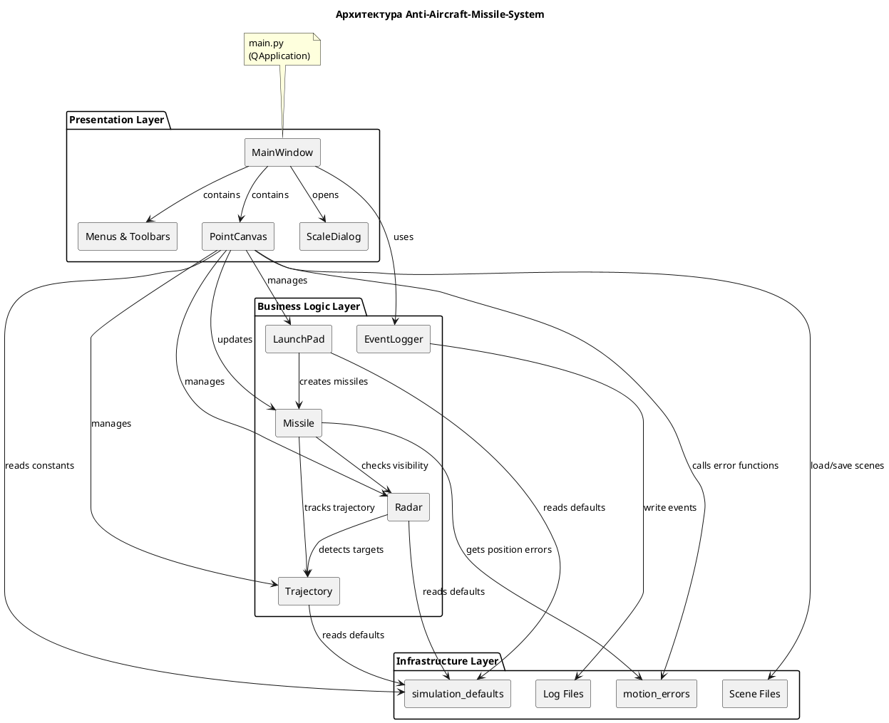
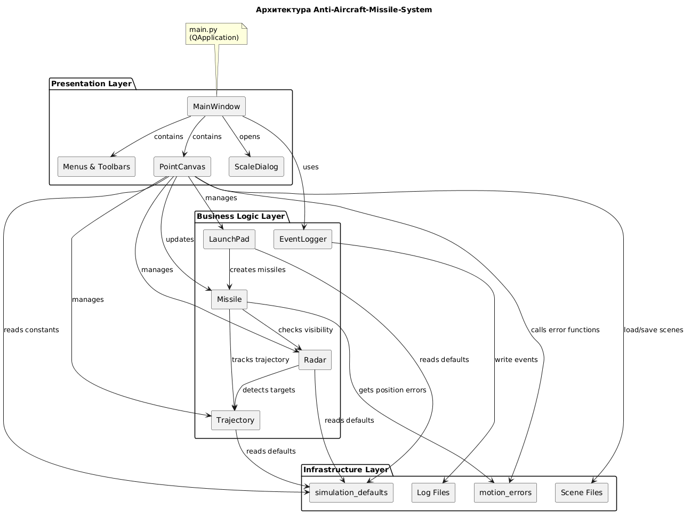
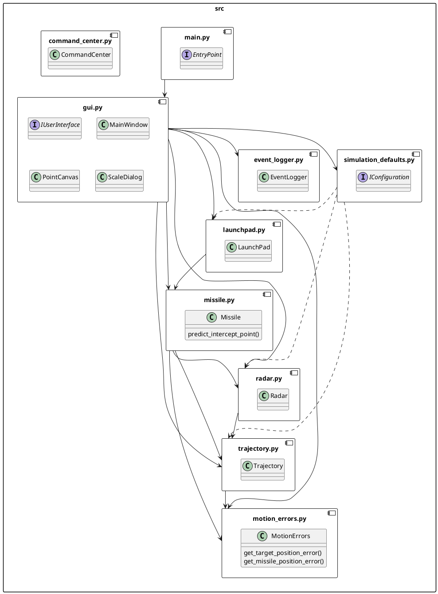
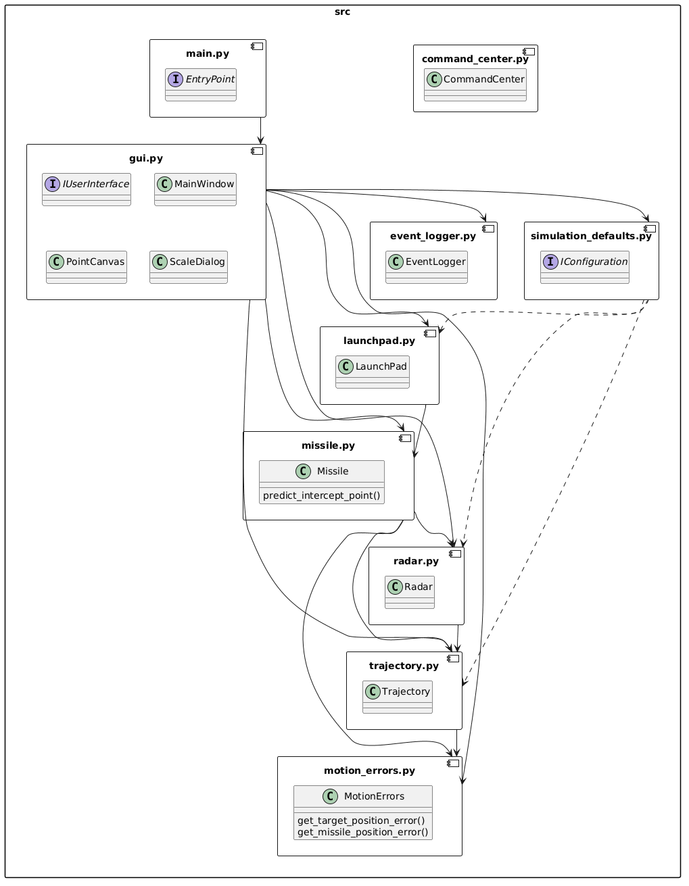
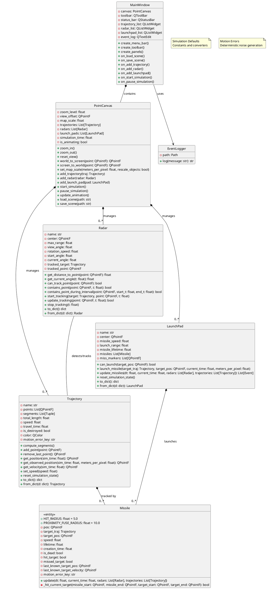
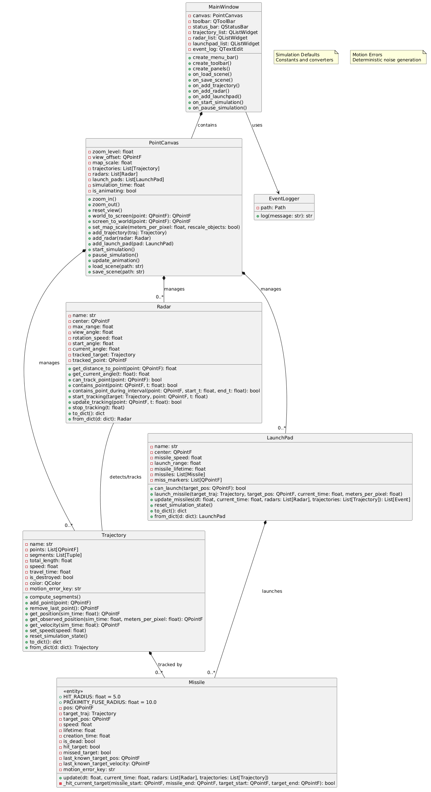
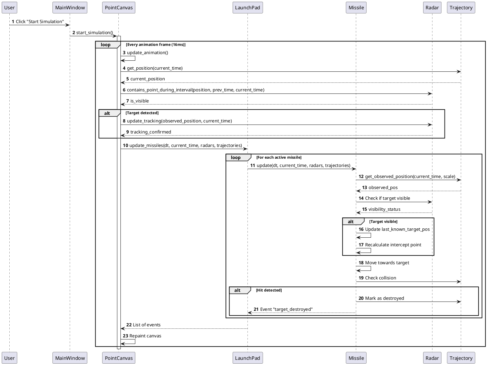
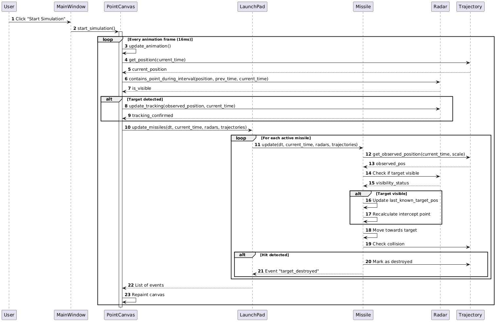
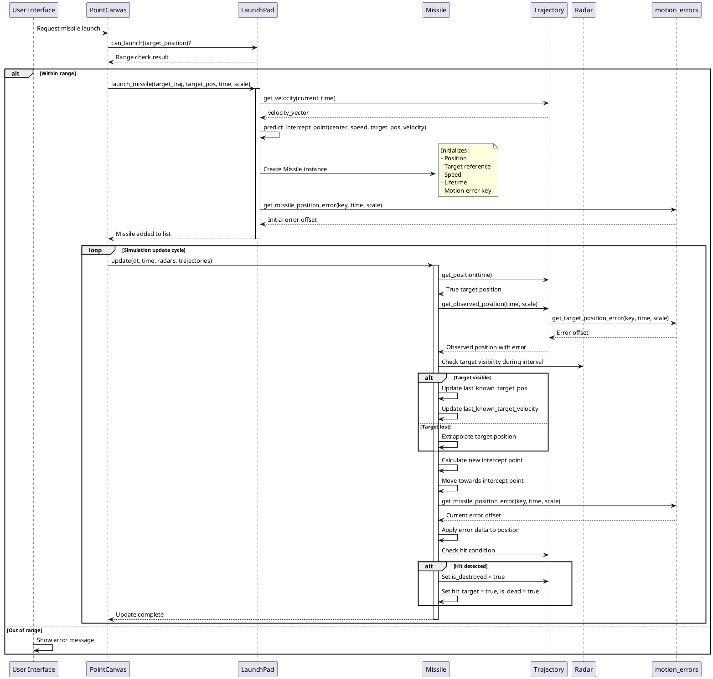
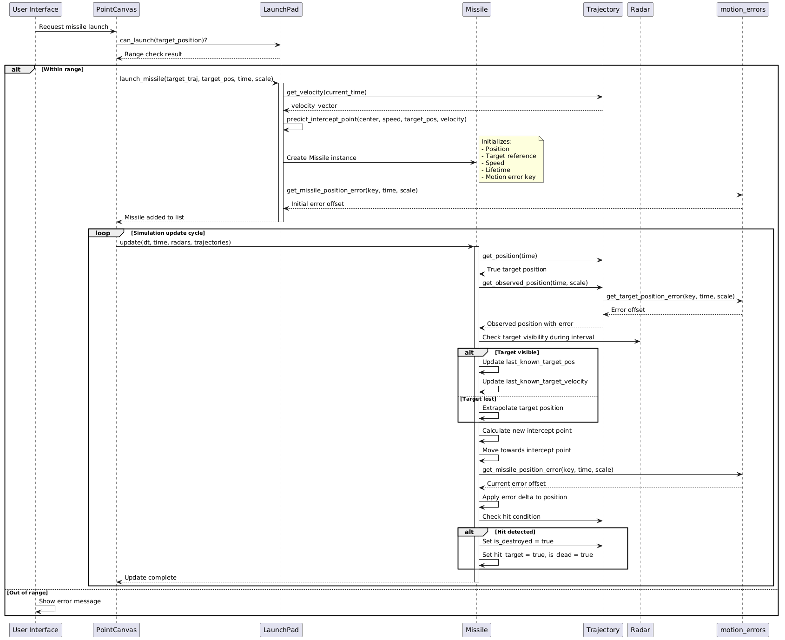

# Техническая документация проекта Anti-Aircraft-Missile-System

## 1 Описание модулей исходного кода

### 1.1. main.py

**Назначение**: Точка входа в приложение.

**Функциональность**:
- Инициализация приложения PyQt6
- Создание экземпляра главного окна MainWindow
- Запуск цикла обработки событий GUI

**Зависимости**:
- PyQt6.QtWidgets.QApplication
- gui.MainWindow

### 1.2. gui.py

**Назначение**: Реализация графического пользовательского интерфейса и основной логики симуляции.

**Основные классы**:

**ScaleDialog**:
- Диалоговое окно для изменения масштаба карты
- Позволяет пользователю задать соотношение метров на пиксель
- Содержит информационную подсказку о влиянии масштаба

**PointCanvas**:
- Основной виджет для отображения тактической обстановки
- Реализует функции:
  - Отрисовка карты местности (фоновое изображение)
  - Отображение сетки координат
  - Масштабирование и панорамирование вида
  - Отрисовка траекторий целей
  - Отображение РЛС и их зон обнаружения
  - Визуализация пусковых установок
  - Анимация движения объектов
  - Отображение шкалы масштаба

**MainWindow**:
- Главное окно приложения
- Содержит:
  - Панель инструментов с кнопками управления
  - Меню файлов, настроек, помощи
  - Панель управления симуляцией
  - Список траекторий, РЛС, пусковых установок
  - Журнал событий симуляции
  - Элементы управления воспроизведением (старт, пауза, перемотка)

**Ключевые функции PointCanvas**:
- `zoom_in()`, `zoom_out()`, `reset_view()` — управление масштабом
- `world_to_screen()`, `screen_to_world()` — преобразование координат
- `set_map_scale()` — установка масштаба карты
- `draw_grid()` — отрисовка координатной сетки
- `draw_scale_bar()` — отрисовка шкалы масштаба
- `set_background_image()` — загрузка фонового изображения карты
- `update_animation()` — обновление состояния симуляции
- `add_trajectory()`, `add_radar()`, `add_launch_pad()` — добавление объектов
- `load_scene()`, `save_scene()` — работа с файлами сценариев

### 1.3. trajectory.py

**Назначение**: Моделирование траектории движения воздушной цели.

**Класс Trajectory**:

**Атрибуты**:
- `name` — наименование траектории
- `points` — список точек траектории (QPointF)
- `segments` — вычисленные сегменты между точками
- `total_length` — общая длина траектории
- `speed` — скорость движения по траектории (пикселей/секунду)
- `travel_time` — время прохождения всей траектории
- `is_destroyed` — флаг уничтожения цели
- `color` — цвет отображения траектории
- `motion_error_key` — ключ для генерации погрешностей

**Методы**:
- `compute_segments()` — вычисление сегментов и общей длины
- `add_point(point)` — добавление точки к траектории
- `remove_last_point()` — удаление последней точки
- `get_position(sim_time)` — получение позиции цели в заданное время
- `get_observed_position(sim_time, meters_per_pixel)` — позиция с учетом погрешности
- `get_position_by_t(t)` — позиция по нормализованному времени (0-1)
- `get_velocity(sim_time)` — вектор скорости в заданный момент
- `set_speed(speed)` — установка скорости
- `reset_simulation_state()` — сброс состояния симуляции
- `to_dict()` — сериализация в словарь
- `from_dict(d)` — десериализация из словаря

### 1.4. radar.py

**Назначение**: Моделирование радиолокационной станции.

**Класс Radar**:

**Атрибуты**:
- `name` — наименование РЛС
- `center` — координаты размещения (QPointF)
- `max_range` — максимальная дальность обнаружения
- `view_angle` — угол обзора антенны (градусы)
- `rotation_speed` — скорость вращения антенны (градусы/секунду)
- `start_angle` — начальный угол ориентации
- `current_angle` — текущий угол ориентации
- `tracked_target` — сопровождаемая цель
- `tracked_point` — сопровождаемая точка

**Методы**:
- `get_distance_to_point(point)` — расстояние до точки
- `get_current_angle(t)` — текущий угол в момент времени t
- `can_track_point(point)` — проверка возможности сопровождения
- `contains_point(point, t)` — проверка попадания точки в зону обнаружения
- `contains_point_during_interval(point, start_t, end_t)` — проверка обнаружения за интервал
- `start_tracking(target, point, t)` — начало сопровождения цели
- `update_tracking(point, t)` — обновление сопровождения
- `stop_tracking(t)` — прекращение сопровождения
- `to_dict()` — сериализация
- `from_dict(d)` — десериализация

### 1.5. launchpad.py

**Назначение**: Моделирование пусковой установки зенитных ракет.

**Класс LaunchPad**:

**Атрибуты**:
- `name` — наименование пусковой установки
- `center` — координаты размещения (QPointF)
- `missile_speed` — скорость ракеты (пикселей/секунду)
- `launch_range` — максимальная дальность пуска
- `missile_lifetime` — время жизни ракеты (секунды)
- `missiles` — список активных ракет
- `miss_markers` — маркеры промахов

**Методы**:
- `get_distance(p1, p2)` — расстояние между точками
- `can_launch(target_pos)` — проверка возможности пуска по цели
- `launch_missile(target_traj, target_pos, current_time, meters_per_pixel)` — запуск ракеты
- `update_missiles(dt, current_time, radars, trajectories)` — обновление состояния ракет
- `reset_simulation_state()` — сброс состояния
- `to_dict()` — сериализация
- `from_dict(d)` — десериализация

### 1.6. missile.py

**Назначение**: Моделирование зенитной управляемой ракеты.

**Константы**:
- `HIT_RADIUS` — радиус прямого попадания (5.0 пикселей)
- `PROXIMITY_FUSE_RADIUS` — радиус срабатывания неконтактного взрывателя (10.0 пикселей)

**Класс Missile**:

**Атрибуты**:
- `pos` — текущая позиция ракеты
- `target_traj` — целевая траектория
- `target_pos` — текущая целевая точка перехвата
- `speed` — скорость ракеты
- `lifetime` — время жизни
- `creation_time` — время запуска
- `is_dead` — флаг завершения полета
- `hit_target` — флаг поражения цели
- `missed_target` — флаг промаха
- `last_known_target_pos` — последняя известная позиция цели
- `last_known_target_velocity` — последняя известная скорость цели
- `motion_error_key` — ключ для генерации погрешностей

**Методы**:
- `update(dt, current_time, radars, trajectories)` — обновление состояния ракеты
- `_hit_current_target(missile_start, missile_end, target_start, target_end)` — проверка попадания

**Функции**:
- `_distance(p1, p2)` — вычисление расстояния
- `_solve_intercept_time(...)` — решение уравнения встречи
- `predict_intercept_point(...)` — прогнозирование точки перехвата

### 1.7. motion_errors.py

**Назначение**: Генерация детерминированных погрешностей измерения координат.

**Константы**:
- `TARGET_POSITION_ERROR_M` — амплитуда погрешности цели (1000 м)
- `MISSILE_POSITION_ERROR_M` — амплитуда погрешности ракеты (500 м)
- `TARGET_ERROR_PERIOD_S` — период изменения погрешности цели (1.5 с)
- `MISSILE_ERROR_PERIOD_S` — период изменения погрешности ракеты (0.35 с)

**Функции**:
- `_stable_noise_sample(seed_key, axis, index)` — генерация стабильного псевдослучайного значения
- `_smoothstep(value)` — функция плавного перехода
- `_get_position_error(...)` — базовая функция получения погрешности
- `get_target_position_error(seed_key, sim_time, meters_per_pixel)` — погрешность цели
- `get_missile_position_error(seed_key, sim_time, meters_per_pixel)` — погрешность ракеты

### 1.8. event_logger.py

**Назначение**: Логирование событий симуляции.

**Класс EventLogger**:

**Атрибуты**:
- `path` — путь к файлу журнала

**Методы**:
- `log(message)` — запись события с временной меткой

### 1.9. simulation_defaults.py

**Назначение**: Определение параметров симуляции по умолчанию.

**Константы**:
- `SPEED_OF_SOUND_MPS` — скорость звука (340 м/с)
- `METERS_PER_PIXEL` — масштаб по умолчанию (500 м/пиксель)
- `MAX_SIMULATION_DURATION_S` — максимальная длительность симуляции
- `ANIMATION_INTERVAL_MS` — интервал обновления анимации (16 мс)
- `DEFAULT_PLAYBACK_SPEED` — скорость воспроизведения по умолчанию

**Параметры целей**:
- `DEFAULT_TARGET_NAME` — наименование цели по умолчанию ("МиГ-31БМ")
- `DEFAULT_TARGET_SPEED_KMH` — скорость цели (3000 км/ч)
- `DEFAULT_TARGET_SPEED_MPS` — скорость цели в м/с
- `DEFAULT_TRAJECTORY_SPEED` — скорость траектории в пикселях/секунду

**Параметры РЛС**:
- `DEFAULT_RADAR_NAME` — наименование РЛС ("Небо-СВ")
- `DEFAULT_RADAR_RANGE_M` — дальность обнаружения (350 км)
- `DEFAULT_RADAR_ROTATION_PERIOD_S` — период вращения антенны (10 с)
- `DEFAULT_RADAR_ROTATION_SPEED` — скорость вращения (градусы/с)
- `DEFAULT_RADAR_VIEW_ANGLE` — ширина луча (6 градусов)

**Параметры пусковых установок**:
- `DEFAULT_LAUNCHPAD_NAME` — наименование комплекса ("С-300ПМУ")
- `DEFAULT_MISSILE_RANGE_M` — дальность пуска (150 км)
- `DEFAULT_MISSILE_SPEED_MPS` — скорость ракеты (2000 м/с)
- `DEFAULT_MISSILE_SPEED` — скорость в пикселях/секунду
- `DEFAULT_LAUNCH_RANGE` — дальность пуска в пикселях
- `DEFAULT_MISSILE_LIFETIME` — время жизни ракеты

**Функции**:
- `meters_to_pixels(distance_m)` — конвертация метров в пиксели
- `mps_to_pixels_per_second(speed_mps)` — конвертация скорости

### 1.10. command_center.py

**Назначение**: Модель командного центра системы ПВО.

**Класс CommandCenter**:

**Атрибуты**:
- `name` — наименование командного центра
- `id` — уникальный идентификатор (UUID)
- `x`, `y`, `z` — координаты размещения
- `target_distribution_algorithm` — алгоритм распределения целей
- `connected_radiolocators` — список подключенных РЛС
- `connected_launchers` — список подключенных пусковых установок

**Примечание**: Данный модуль содержит ссылки на несуществующие модули `.radiolocator` и `.rocket_launcher`, что указывает на незавершенность реализации или наличие устаревшего кода.

## 2. Формат файлов сценариев

Файлы сценариев хранятся в формате JSON со следующей структурой:

```json
{
    "version": 2,
    "trajectories": [
        {
            "name": "Траектория 1",
            "color": {"r": 40, "g": 193, "b": 3},
            "speed": 200.0,
            "points": [[x1, y1], [x2, y2], ...]
        }
    ],
    "radars": [
        {
            "name": "РЛС 1",
            "center": [x, y],
            "max_range": 100.0,
            "view_angle": 90.0,
            "rotation_speed": 45.0,
            "start_angle": 0.0
        }
    ],
    "launchpads": [
        {
            "name": "ПУ 1",
            "center": [x, y],
            "missile_speed": 200.0,
            "launch_range": 200.0,
            "missile_lifetime": 5.0
        }
    ]
}
```

---

## 3. Архитектура системы

### 3.1. Общая архитектура

Система построена по модульному принципу с четким разделением ответственности между компонентами. Архитектура следует паттерну Model-View-Controller (MVC) с элементами событийно-ориентированного программирования.





### 3.2. Компонентная диаграмма





### 3.3. Диаграмма классов





### 3.4. Диаграмма последовательности запуска симуляции





### 3.5. Поток данных при запуске ракеты




